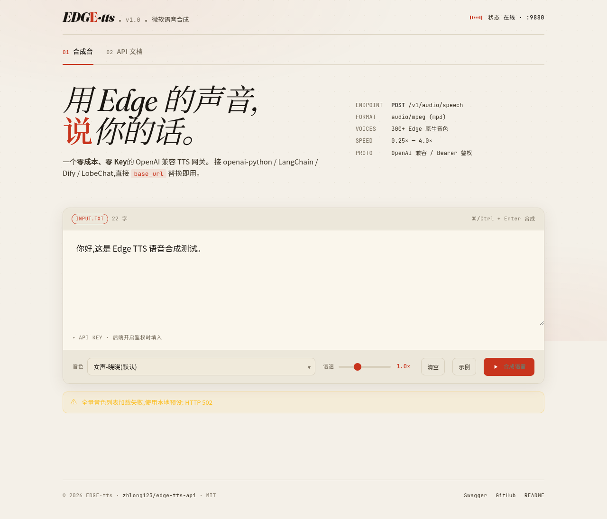
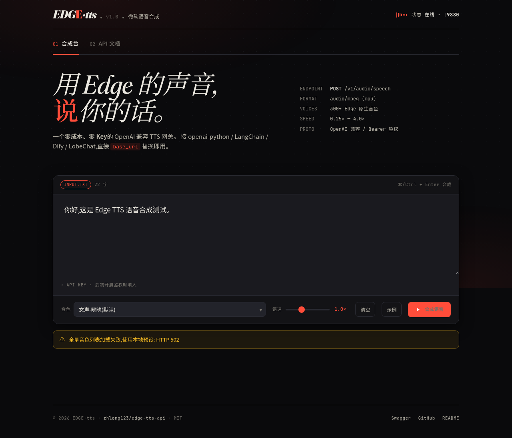
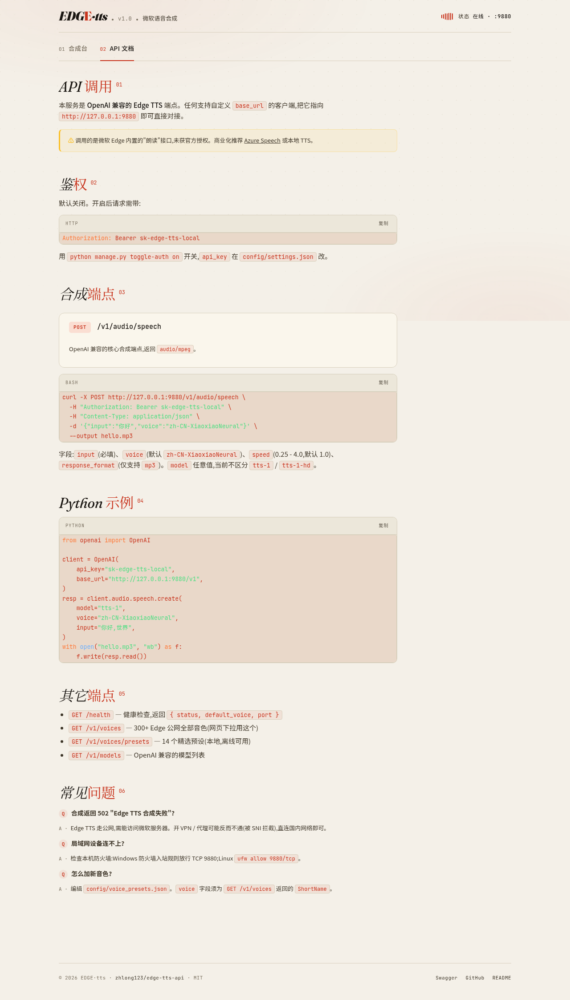
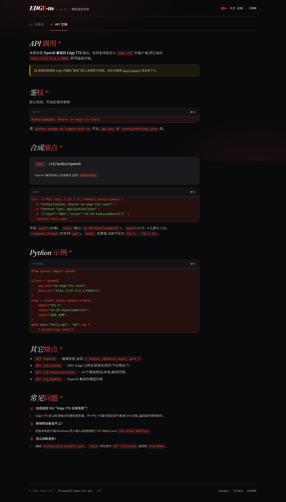
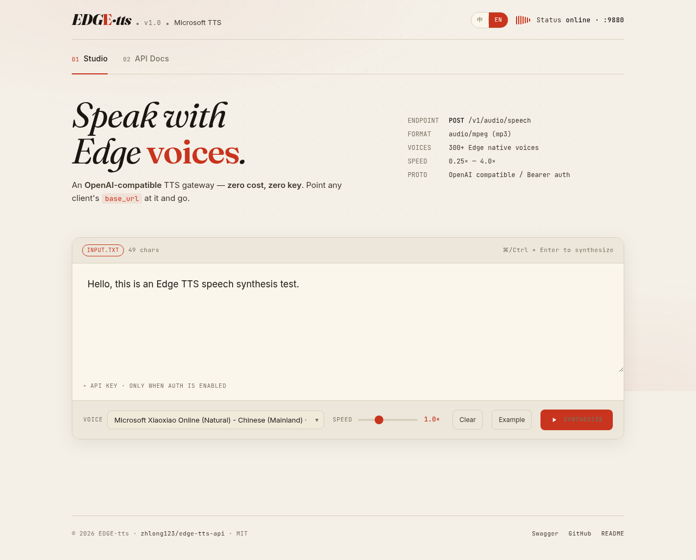
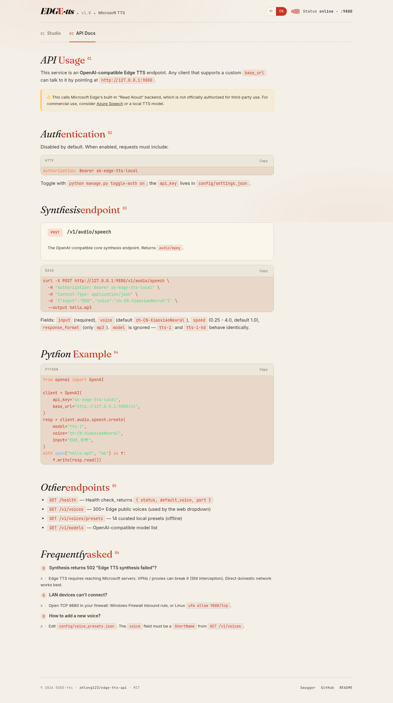

<div align="center">

# EDGE · tts

**OpenAI 兼容的微软 Edge TTS 独立语音合成服务 — 零成本、零 Key、零部署**
<br/>
Any OpenAI client can talk to it — just point `base_url` at the gateway.

<br/>


</div>

---

## ✨ 特性

| | |
|---|---|
| 🎙 **300+ Edge 原生音色** | 内置 322 个微软 Edge 浏览器内置音色,按 Locale 分组,常见语言置顶 |
| 🔌 **OpenAI 兼容** | `POST /v1/audio/speech` 直接对接 openai-python / LangChain / Dify / Open WebUI / LobeChat |
| 🆓 **零成本** | 走微软 Edge TTS 公网接口,不需要 Azure Key |
| 🌐 **网页测试台** | 启动后浏览器开 <http://127.0.0.1:9880/> 即可在线合成、试听、下载 |
| 🏠 **局域网友好** | 默认监听 `0.0.0.0`,`python manage.py lan-url` 一键拿到 LAN IP |
| 🪟 **Windows 友好** | 自带中文 bat 菜单(GBK 编码),双击启动 |
| 🔐 **可插拔鉴权** | Bearer Token 按需开关 |
| ⚙️ **配置热改** | `python manage.py set-voice/set-port/toggle-auth` 改完立即生效 |

---

## 📸 截图

### 合成测试台

<p align="center">
  
  <br/><em>浅色模式</em>
</p>

<p align="center">
  
  <br/><em>深色模式 · 跟随系统主题</em>
</p>

### API 文档

<p align="center">
  
  <br/><em>集成在网页里的 API 文档</em>
</p>

<p align="center">
  
</p>

### English UI

<p align="center">
  
  <br/><em>Studio (English)</em>
</p>

<p align="center">
  
  <br/><em>API Docs (English)</em>
</p>

默认中文,顶栏一键切换中/EN,自动跟随浏览器语言,选择记忆到 localStorage。

---

## 🚀 快速开始

### Windows(推荐)

双击 `edge-tts-api.bat`,弹出中文菜单:

```
================================
   Edge TTS API 管理菜单
================================
[1] 安装依赖
[2] 启动服务
[3] 停止服务
[4] 重启服务
[5] 切换音色
[6] 测试合成
[7] 查看状态
[8] 查看配置
[9] 修改端口
[0] 切换鉴权开关
[Q] 退出
================================
```

**首次使用**:先选 `[1]`,再选 `[2]`。

> 菜单文件 `edge-tts-menu.bat` 由 `build_bat.py` 生成(GBK 编码)。
> 如需改菜单文字:编辑 `build_bat.py` → `python build_bat.py` 重新生成。

### macOS / Linux

```bash
git clone https://github.com/zhlong123/edge-tts-api.git
cd edge-tts-api
pip install -r requirements.txt
python -m app.main
```

服务默认监听 `http://0.0.0.0:9880`,浏览器打开 <http://127.0.0.1:9880/> 即可使用网页测试台。

---

## 🌐 网页测试台

启动服务后,浏览器访问 <http://127.0.0.1:9880/> 即可打开。零外部依赖,内联 CSS+JS。

**特性**:
- ✏️ 大文本编辑区 + 实时字符计数
- 🎙 322 个 Edge 原生音色(按语言分组,常见语言置顶,显示 FriendlyName + 性别)
- 🏃 语速滑块 0.5× ~ 2.0×(步进 0.1)
- ▶️ 一键合成 → 浏览器内播放 + 下载 MP3
- 🟢 顶栏实时显示后端健康状态(声波动画)
- 🔐 鉴权模式自动展开 API Key 输入框
- ⌨️ 快捷键 `Ctrl/⌘ + Enter`
- 🌓 跟随系统主题,深色/浅色自适应

> 完整功能说明在网页内的 **📖 API 文档** tab。

---

## 🔌 API

### `POST /v1/audio/speech` — 合成(核心)

**请求体**:

```json
{
  "model": "tts-1",
  "input": "你好,世界",
  "voice": "zh-CN-XiaoxiaoNeural",
  "response_format": "mp3",
  "speed": 1.0
}
```

| 字段 | 类型 | 必填 | 说明 |
|---|---|---|---|
| `model` | string | — | 任意值,当前不区分 `tts-1` / `tts-1-hd` |
| `input` | string | ✓ | 要合成的文本,最长约 10 分钟 |
| `voice` | string | — | Edge TTS 音色 ID(见 `/v1/voices`) |
| `response_format` | string | — | 当前仅支持 `mp3` |
| `speed` | float | — | 0.25 - 4.0,1.0 为原速 |

**响应**:`audio/mpeg` 二进制流。

### 其它端点

| 端点 | 说明 |
|---|---|
| `GET /health` | 健康检查,返回 `{ status, default_voice, port }` |
| `GET /v1/voices` | 322 个 Edge 公网全部音色(网页下拉用这个) |
| `GET /v1/voices/presets` | 14 个精选预设(本地,离线可用) |
| `GET /v1/models` | OpenAI 兼容的模型列表 |
| `GET /docs` | FastAPI 自动生成的 Swagger 文档 |

### OpenAI 客户端接入

```python
from openai import OpenAI

client = OpenAI(
    api_key="sk-edge-tts-local",          # 本服务 api_key,见 config/settings.json
    base_url="http://127.0.0.1:9880/v1",  # OpenAI 兼容入口
)

resp = client.audio.speech.create(
    model="tts-1",
    voice="zh-CN-XiaoxiaoNeural",
    input="你好,世界",
)

with open("hello.mp3", "wb") as f:
    f.write(resp.read())
```

其它框架:

- **LangChain**:`ChatOpenAI(base_url="http://127.0.0.1:9880/v1", ...)` + 自定义 TTS 节点
- **Dify**:TTS 节点选 `OpenAI TTS`,填本服务 `api_url`
- **Open WebUI / LobeChat**:TTS 设置里把 OpenAI endpoint 改成 `http://127.0.0.1:9880/v1`

---

## 🏠 局域网访问

后端默认监听 `0.0.0.0:9880`,同网段其他设备(手机 / 平板 / 电脑)可用本机 IP 直接访问。

```bash
python manage.py lan-url
# → http://192.168.31.237:9880/
```

Windows 启动菜单启动服务后,也会自动在菜单顶部显示所有 LAN URL。

> **如果连不上**:检查本机防火墙是否放行 9880 端口。
> - **Windows**:控制面板 → Windows Defender 防火墙 → 高级设置 → 入站规则 → 新建规则(端口 TCP 9880)
> - **macOS**:系统设置 → 网络 → 防火墙 → 允许 Edge TTS API
> - **Linux**:`sudo ufw allow 9880/tcp`(如用 ufw)

### 鉴权模式下的访问

如果后端 `require_auth=true`,网页测试台里点击 `API Key` 折叠项填入 `config/settings.json` 里的 `api_key` 即可(会记忆到 localStorage)。其他 OpenAI 客户端按 OpenAI 兼容接入方式带 `Authorization: Bearer <api_key>` 头。

---

## ⚙️ 配置

编辑 `config/settings.json`:

```json
{
  "host": "0.0.0.0",
  "port": 9880,
  "api_key": "sk-edge-tts-local",
  "default_voice": "zh-CN-XiaoxiaoNeural",
  "require_auth": false
}
```

| 字段 | 默认值 | 说明 |
|---|---|---|
| `host` | `0.0.0.0` | 监听地址(`127.0.0.1` 仅本机访问) |
| `port` | `9880` | HTTP 端口 |
| `api_key` | `sk-edge-tts-local` | 鉴权 Token(`require_auth=true` 时必填) |
| `default_voice` | `zh-CN-XiaoxiaoNeural` | 默认音色 |
| `require_auth` | `false` | 是否开启 Bearer 鉴权 |

也可以用 `python manage.py` 命令行改:

```bash
python manage.py show-config            # 打印当前配置
python manage.py list-presets           # 列出所有预设音色
python manage.py set-voice <voice_id>   # 切换默认音色
python manage.py set-port <port>        # 切换端口
python manage.py toggle-auth on|off     # 开关鉴权
python manage.py health                 # 健康检查
python manage.py lan-url                # 列出所有可局域网访问的 URL
python manage.py test-tts "你好" out.mp3  # 测试合成
```

---

## ❓ 常见问题

**Q: 启动后访问 `/health` 报 Connection refused?**

A: 看 `logs/server.log`(如果写了日志),或 `python manage.py is-running` 查状态。

**Q: 合成返回 502 "Edge TTS 合成失败"?**

A: Edge TTS 走公网,需能访问微软服务器。开 VPN / 代理可能反而不通(被 SNI 拦截),直连国内网络即可。

**Q: `response_format=wav` 报 400?**

A: 当前仅支持 `mp3`。要扩展可以加 `pydub` + `ffmpeg` 转码,欢迎 PR。

**Q: 怎么加新音色?**

A: 编辑 `config/voice_presets.json`,加 `{"id": <n>, "name": "...", "lang": "...", "voice": "..."}`。`voice` 字段必须是 `GET /v1/voices` 返回列表里 `ShortName` 的值。

**Q: 网页下拉里看不到所有音色?**

A: 优先拉全量 `/v1/voices`(322 个)。如果 Edge 接口返回 502,会自动降级到本地 14 个预设。可重试或检查网络。

---

## 🛠 开发

```bash
# 安装开发依赖
pip install -r requirements.txt

# 本地启动(热重载)
uvicorn app.main:app --host 0.0.0.0 --port 9880 --reload

# 改菜单后重新生成
python build_bat.py
```

OpenAPI 文档:<http://127.0.0.1:9880/docs>

---

## 📁 项目结构

```
edge-tts-api/
├── app/                      # FastAPI 应用
│   ├── __init__.py
│   ├── main.py               # 路由 + lifespan + 静态前端 mount
│   ├── auth.py               # Bearer Token 鉴权
│   ├── config.py             # settings.json 读写
│   └── edge_engine.py        # Edge TTS 封装 (synthesize / voices)
├── web/                      # 网页测试台(单文件 SPA,FastAPI 启动后访问 / 即可)
│   └── index.html            # 文本/音色/语速/合成/播放/下载 + API 文档
├── config/
│   ├── settings.json         # 运行时配置(端口/鉴权/默认音色)
│   └── voice_presets.json    # 精选音色预设
├── docs/                     # 文档与截图
│   ├── web-ui-test.png
│   ├── web-ui-test-dark.png
│   ├── web-ui-docs.png
│   └── web-ui-docs-dark.png
├── manage.py                 # 命令行工具(供 bat 调用)
├── build_bat.py              # 生成 edge-tts-menu.bat 的脚本
├── edge-tts-api.bat          # 启动入口(打开菜单)
├── edge-tts-menu.bat         # 中文菜单(GBK)
├── test-bat.cmd              # 菜单自检
├── requirements.txt
├── .gitignore
└── README.md
```

---

## ⚠️ 免责声明

> **本项目不是微软官方服务,与 Microsoft Corporation 无任何隶属或合作关系。**

- **接口来源**:本服务调用的 TTS 引擎来自微软 Edge 浏览器内置的"朗读"功能后端(`wss://speech.platform.bing.com/...`),**微软未公开授权第三方使用**。本项目通过逆向分析浏览器行为模拟访问,**不保证稳定性,亦不保证长期可用**。
- **合规风险**:在微软 ToS 与《可接受使用政策》下,此用法属于"未经授权的自动化访问"。**个人非商业学习使用风险较低;商业化 / 对外提供服务 / 大规模并发调用风险较高**,请自行评估并承担后果。
- **替代方案**:若有合规需求,建议改用 [Azure AI Speech(微软官方 TTS)](https://learn.microsoft.com/azure/ai-services/speech-service/) 有免费额度,或本地模型 Piper / Coqui TTS / CosyVoice 等开源离线方案。
- **作者立场**:仅作为技术研究 / 个人工具发布,不鼓励、不支持任何违反微软 ToS 的商业用途。
- **Microsoft、Windows、Azure、Edge、Bing** 均为 Microsoft Corporation 的商标,本项目提及仅为客观描述。

---

## 📜 License

MIT
